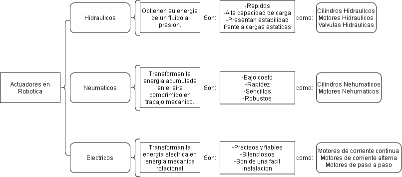

# Actuadores

## :trophy: C2.1 Reto en clase

**Actuadores Neumatico e Hidraulicos, y sus tipos**

### :blue_book: Instrucciones

- De acuerdo con la información presentada por el asesor referente al tema actuadores y a los videos observados sobre el mismo tema, elabore lo que se solicita dentro del apartado desarrollo.

### :pencil2: Desarrollo

Listado de preguntas:

1. Basándose en el video [actuadores en Robótica](https://www.youtube.com/watch?v=e_6rjEGWqoY), realice un cuadro sinóptico sobre la clasificación de los actuadores.

            
    

2. De acuerdo con el video [descripcion de los actuadores industriales](https://www.youtube.com/watch?v=mFsPxpFHajM) realice una matriz comparativa indicando clasificacion, subclasificacion, principio de funcionamiento, ventajas y desventajas.

            
    

3. De acuerdo con el video [Neumática Industrial](https://www.youtube.com/watch?v=Wee85cI6wwQ&t=394s), explique como trabaja un sistema Neumático?

Un sistema neumático trabaja de manera que el compresor generara la energía que alimentara el sistema mediante el aire comprimido, el cual viajara por el separador de líquidos y luego por algunos filtros, esto para eliminar partículas que puedan obstruir el trabajo, luego pasara por el regulador el cual pasara la a presión para el sistema.
Después pasara a la válvula de control direccional el cual es el que generara el movimiento para que realice el trabajo deseado, también será necesario un controlador para que la válvula vaya cambiando y haya movimiento.
Aquí pasara a un actuador que convertirá el aire comprimido en movimiento, de manera que la válvula mande el aire comprimido y este la empuje hacia enfrente y atrás
Todo esto con el propósito de realizar un trabajo en específico en un entorno industrial.

### :bomb: Rubrica

| Criterios     | Descripción                                                                                  | Puntaje |
| ------------- | -------------------------------------------------------------------------------------------- | ------- |
| Instrucciones | Se cumple con cada uno de los puntos indicados dentro del apartado Instrucciones?            | 20 |
| Desarrollo    | Se respondió a cada uno de los puntos solicitados dentro del desarrollo de la actividad?     | 80      |

:house: [GitHub](https://github.com/EmmanuelARodriguez/Markdown)
