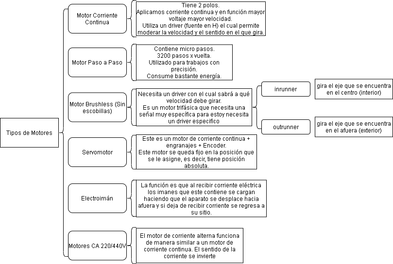

# Actuadores

## :trophy: C2.2 Actuadores eléctricos

**Actuadores eléctricos y sus tipos**

### :blue_book: Instrucciones

- De acuerdo con la información presentada por el asesor referente al tema actuadores y a los videos observados sobre el mismo tema, elabore lo que se solicita dentro del apartado desarrollo.

## :pencil2: Desarrollo

Listado de preguntas:

1. Basado en el video [tipos de motores eléctricos](https://www.youtube.com/watch?v=pgr4yRMnB_A) elabore un cuadro sinoptico indicando su clasificación, y principio de funcionamiento.

            
    

2. De acuerdo con el video [instalación básica de neumática y arduino](https://www.youtube.com/watch?v=DdvLAXfuNpY&t=8s), cual es el propósito del microcontrolador para este sistema? Que otros componentes electrónicos observa en el video?

El propósito del microprocesador es que saque cierta cantidad de voltios en este caso 5V, para enviarlos a la tira de relé el cual lo transmitirá tomando de la tira 24V mandándolo a las electroválvulas donde pasaría el aire por el conducto hasta un actuador neumático en este caso un cilindro de doble efecto y también a un actuador de pinzas.

**Componentes electrónicos**
- microprocesador
- Fuente de alimentación externa
- Salida de 5V
- Módulo de relé

3. Basandose en el video [Como funciona la impresora 3D](https://www.youtube.com/watch?v=C4HAJ5HLuB4), que tipo de sensores y actuadores están integrados, y con que proposito es utilizado dentro de este sistema de impresión? 

- **Motor de paso a paso:**
Lo que hacen los motores es mover el extrusor en los ejes distintos y,x,z
- **Sensor de proximidad:**
Se utiliza para medir la distancia entre el extrusor hasta lo que es la base y saber donde se iniciara la impresion
- **Sensor de presion:**
Es utilizado para medir con precisión la inclinación de la superficie de impresión.

### :bomb: Rubrica

| Criterios     | Descripción                                                                                  | Puntaje |
| ------------- | -------------------------------------------------------------------------------------------- | ------- |
| Instrucciones | Se cumple con cada uno de los puntos indicados dentro del apartado Instrucciones?            | 20 |
| Desarrollo    | Se respondió a cada uno de los puntos solicitados dentro del desarrollo de la actividad?     | 80      |

:house: [GitHub](https://github.com/EmmanuelARodriguez/Markdown)